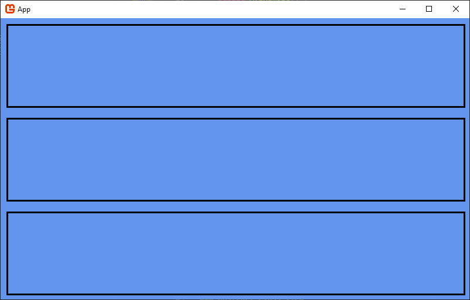

# Layouts

Layouts is a platform agnostic UI layout library for C#. You supply the IO, Layouts does the rest!

## Quick Start



```csharp
class Box : View {
    public override void Draw() {
        MyDrawFunction(this.VisibleRect);
    }
}

class MyExample {
    private Root root;
    
    public MyExample() {
        this.root = new Root(
            new VerticalStack {
                Children = {
                    new Padding(10, new Box() { Size = new Sizing { ProportionalWidth = 1f, FillHeight = true } }),
                    new Padding(10, new Box() { Size = new Sizing { ProportionalWidth = 1f, FillHeight = true } }),
                    new Padding(10, new Box() { Size = new Sizing { ProportionalWidth = 1f, FillHeight = true } }),
                }
            }
        );
    }

    public void Update() {
        this.root.ComputeRects(new Rect(0, 0, MyWindowWidth, MyWindowHeight));
        this.root.RegisterMouseMove(MyMouseX, MyMouseY);
        this.root.RegisterMouseButton(MouseButton.Left, MyMouseLeftButtonState);
        this.root.RegisterMouseScroll(MyMouseScrollDeltaX, MyMouseScrollDeltaY);
        this.root.Update();
    }

    public void Draw() {
        this.root.Draw();
    }
}
```

This example creates a vertical stack of three boxes, each padded by 10px.

The width of each box is set to 100% of the parent's width, and the height is set to fill the parent's height.
Since there are three boxes, each box takes up 1/3 of the parent's height.

## Documentation

```csharp
// The root of the UI tree which is responsible for managing updates and events.
// Note that this is not a view itself.
public class Root {
    // The root view of the UI tree
    public View RootView { get; set; }
    // The currently focused view
    public View? Focus { get; set; }

    // Constructs a new root with the given root view
    public Root(View rootView);

    // Computes the rects of the views in the tree.
    // This should be called whenever any rect changes (usually
    // every frame if scrolling is desired).
    public void ComputeRects(Rect rect);

    // Calls Draw on every visible view in order
    public void Draw();

    // Call this once per frame.
    public void Update();

    // Registers a mouse move event
    public void RegisterMouseMove(int x, int y);
    // Registers a mouse button event if there is a button state change
    public void RegisterMouseButton(MouseButton button, bool down);
    // Registers a mouse scroll event
    public void RegisterMouseScroll(float deltaX, float deltaY);
}

// The base class for all UI elements
public abstract class View {
    // The size of the view
    public Sizing Size { get; set; }
    // The area that the view takes up
    public Rect ComputedRect { get; }
    // The area of the view that is visible
    public Rect VisibleRect { get; }
    // The horizontal alignment mode used when the view is inside a VerticalStack
    public Alignment HorizontalAlignment { get; set; }
    // The vertical alignment mode used when the view is inside a HorizontalStack
    public Alignment VerticalAlignment { get; set; }
    // The visibility state of the view
    public bool Visible { get; set; }
    // The interactable state of the view used for mouse events
    public bool Interactable { get; set; }

    // Events
    public abstract void Draw();
    public virtual void OnMouseEnter();
    public virtual void OnMouseLeave();
    public virtual void OnMouseDown(MouseEventArgs e);
    public virtual void OnMouseUp(MouseEventArgs e);
    public virtual void OnMouseDrag(MouseDragEventArgs e);
    public virtual void OnMouseScroll(MouseScrollEventArgs e);
    public virtual void OnFocusGained();
    public virtual void OnFocusLost();
}

// A view that arranges child views in a vertical stack
public class VerticalStack : ... View {
    // The vertical alignment of the children in the stack
    public Alignment StackAlignment { get; set; } = Alignment.Start;

    // Specified what happens when the stack cannot fit all of its children
    public Overflow Overflow { get; set; } = Overflow.Scroll;
    // The current scroll amount
    public float Scroll { get; set; }
    // The maximum scroll amount
    public float ScrollMax { get; }
    // The scroll speed
    public float ScrollSpeed { get; set; };

    // The children of the stack
    public List<View> Children { get; }
}

// A view that arranges child views in a vertical stack
public class HorizontalStack : ... View {
    // The horizontal alignment of the children in the stack
    public Alignment StackAlignment { get; set; } = Alignment.Start;

    // Specified what happens when the stack cannot fit all of its children
    public Overflow Overflow { get; set; } = Overflow.Scroll;
    // The current scroll amount
    public float Scroll { get; set; }
    // The maximum scroll amount
    public float ScrollMax { get; }
    // The scroll speed
    public float ScrollSpeed { get; set; };

    // The children of the stack
    public List<View> Children { get; }
}

// A view that arranges child views in a grid of evenly sized cells
public class Grid : ... View {
    // The width of each column
    public SizeCalculation ColumnWidth { get; set; } = (w, h) => w / 8;
    // The height of each row
    public SizeCalculation RowHeight { get; set; } = (w, h) => ColumnWidth(w, h);
    // Sets the number of columns as a fixed number
    public int ColumnCount { set; }
    // Computes the row height from the column width and the aspect ratio
    public float CellAspect { set; }
    // The horizontal alignment of whole grid if there is extra space available
    public Alignment GridHorizontalAlignment { get; set; } = Alignment.Start;
    // The vertical alignment of whole grid if there is extra space available
    public Alignment GridVerticalAlignment { get; set; } = Alignment.Start;
    
    // Specified what happens when the stack cannot fit all of its children vertically
    public Overflow Overflow { get; set; } = Overflow.Scroll;
    // The current scroll amount
    public float Scroll { get; set; }
    // The maximum scroll amount
    public float ScrollMax { get; }
    // The scroll speed
    public float ScrollSpeed { get; set; };

    // The children of the stack
    public List<View> Children { get; }
}

// A view that arranges child views over each other
public class Overlay : ... View {
    // The children of the overlay with the first child being at the back-most layer
    public List<View> Children { get; }
}

// A view that applies a padding to its child
public class Padding : ... View {
    // The padding on each side of the child
    public int Top { get; set; }
    public int Bottom { get; set; }
    public int Left { get; set; }
    public int Right { get; set; }

    // The child view
    public View Child { get; }

    // Constructors
    public Padding(View child);
    public Padding(int lrtb, View child);
    public Padding(int lr, int tb, View child);
    public Padding(int left, int right, int top, int bottom, View child);
}

// Used to calculate the size of a view
public class Sizing {
    // The width and height of the view as a function of the parent's width and height
    public SizeCalculation Width { get; set; } = (w, h) => w;
    public SizeCalculation Height { get; set; } = (w, h) => h;
    
    // Indicated whether the view should fill rest of the parent's width when inside a HorizontalStack
    public bool FillWidth { get; set; } = false;
    // Indicated whether the view should fill rest of the parent's height when inside a VerticalStack
    public bool FillHeight { get; set; } = false;

    // Sets the width and height of the view to a fixed value
    public int FixedWidth { set; }
    public int FixedHeight { set; }

    // Sets the width and height of the view to a proportion of the parent's width and height
    public float ProportionalWidth { set; }
    public float ProportionalHeight { set; }

    // The following two properties must not be used together!

    // Computes the height from the width and aspect ratio
    public float AspectByWidth { set; }
    // Computes the width from the height and aspect ratio
    public float AspectByHeight { set; }
}

// Specified what happens when a view cannot fit all of its children
public enum Overflow {
    // The children remain visible
    Visible,
    // The children are clipped
    Hidden,
    // The children are clipped the view can be scrolled
    Scroll
}

// Specifies the alignment mode
public enum Alignment {
    // Align to the left or top
    Start,
    // Align to the center
    Centre,
    // Align to the right or bottom
    End,
}

// A function used to calculate the current view's size given the parent's size
public delegate int SizeCalculation(int parentWidth, int parentHeight);
```

# Example


```csharp
this.root = new Root(
    new Padding(10, new VerticalStack {
        Children = {
        new Padding(10, 10, 0, 0, new HorizontalStack {
            Size = new Sizing { ProportionalHeight = 0.5f },
            Children = {
            new Padding(0, 10, 10, 10, new Box() { Size = new Sizing { FixedWidth = 200 } }),
            new Padding(10, new Box() { Size = new Sizing { FixedWidth = 200 } }),
            new Padding(10, new Box() { Size = new Sizing { FixedWidth = 200 } }),
            new Padding(10, new Box() { Size = new Sizing { FixedWidth = 200 } }),
            new Padding(10, new Box() { Size = new Sizing { FixedWidth = 200 } }),
            new Padding(10, new Box() { Size = new Sizing { FixedWidth = 200 } }),
            new Padding(10, new Box() { Size = new Sizing { FixedWidth = 200 } }),
            new Padding(10, new Box() { Size = new Sizing { FixedWidth = 200 } }),
            new Padding(10, new Box() { Size = new Sizing { FixedWidth = 200 } }),
            new Padding(10, 0, 10, 10, new Box() { Size = new Sizing { FixedWidth = 200 } }),
            }
        }),
        new Padding(10, new Box() { Size = new Sizing { FixedHeight = 200 } }),
        new Padding(10, new Box() { Size = new Sizing { FixedHeight = 200 } }),
        new Padding(10, new Box() { Size = new Sizing { FixedHeight = 200 } }),
        new Padding(10, new Box() { Size = new Sizing { FixedHeight = 200 } }),
        new Padding(10, new Box() { Size = new Sizing { FixedHeight = 200 } }),
        new Padding(10, new Box() { Size = new Sizing { FixedHeight = 200 } }),
        new Padding(10, new Box() { Size = new Sizing { FixedHeight = 200 } }),
        new Padding(10, new Box() { Size = new Sizing { FixedHeight = 200 } }),
        new Padding(10, new Box() { Size = new Sizing { FixedHeight = 200 } }),
        new Padding(10, new Box() { Size = new Sizing { FixedHeight = 200 } }),
        }
    })
);
```
